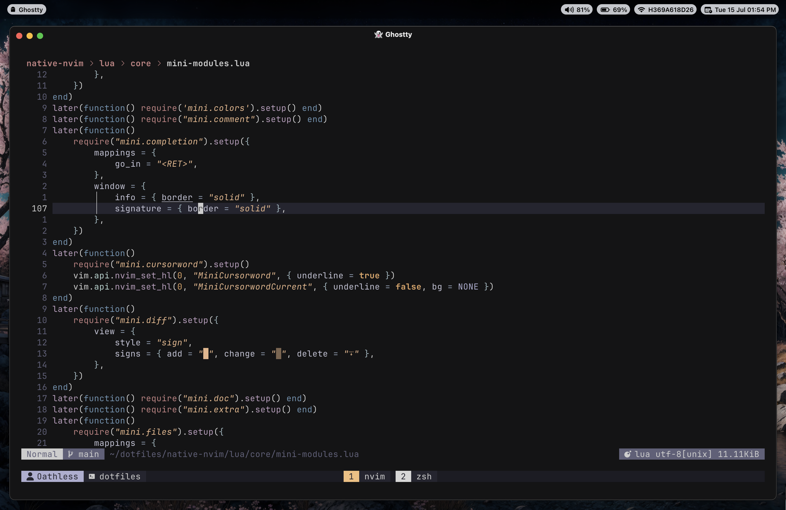

<div align="center">


<br/>


<a href="https://opensource.org/licenses/MIT"></a>

_A carefully curated collection of configuration files for a productive development environment_

</div>

## 📸 Screenshots

<div align="center">
  
  
</div>

_For more screenshots, see [Showcase](docs/showcase.md)_

## 📦 What's Inside

This repository contains configuration files for various tools and applications:

- **[zshrc](zshrc/)** - Z Shell configuration
- **[nvim](nvim/)** - Neovim configuration
- **[tmux](tmux/)** - Terminal multiplexer configuration
- **[kitty](kitty/)** - GPU-based terminal emulator
- **[wezterm](wezterm/)** - GPU-accelerated cross-platform terminal emulator
- **[lazygit](lazygit/)** - Terminal UI for git commands
- **[sketchybar](sketchybar/)** - macOS status bar replacement
- **[aerospace](aerospace/)** - Window manager for macOS
- **[yazi](yazi/)** - Terminal file manager
- **[oh-my-posh](oh-my-posh/)** - Prompt theme engine
- **[homebrew](homebrew/)** - Package manager backup
- **[fonts](fonts/)** - Custom fonts collection
- **[wallpapers](wallpapers/)** - Custom wallpapers

## 🚀 Installation

### Prerequisites

**Homebrew**

```bash
/bin/bash -c "$(curl -fsSL https://raw.githubusercontent.com/Homebrew/install/HEAD/install.sh)"
```

**Git & Stow**

```bash
brew install git stow
```

### Setup Steps

**1. Clone**

```bash
cd ~ && git clone git@github.com:PraveenGongada/dotfiles.git
cd dotfiles
```

**2. Symlink**

```bash
stow .
```

**3. Configure ZSH**

```bash
echo 'export ZDOTDIR="$HOME/.config/zshrc"' >> ~/.zshenv
```

**4. Install Packages**

```bash
xargs brew install < ~/.config/homebrew/leaves.txt
xargs brew install --cask < ~/.config/homebrew/casks.txt
```

### Backup Homebrew Packages

```bash
brew leaves -r > ~/.config/homebrew/leaves.txt
brew list --cask > ~/.config/homebrew/casks.txt
```

### Install Custom Fonts

> ⚠️ **Warning**  
> This will overwrite any fonts with the same name in your system

```bash
find ~/.config/fonts/default/ -type f \( -name '*.ttf' -o -name '*.otf' \) -exec cp {} ~/Library/Fonts/ \;
find ~/.config/fonts/store/ -type f \( -name '*.ttf' -o -name '*.otf' \) -exec cp {} ~/Library/Fonts/ \;
```

To install a specific font:

```bash
find ~/.config/fonts/$PATH_TO_FONT/ -type f \( -name '*.ttf' -o -name '*.otf' \) -exec cp {} ~/Library/Fonts/ \;
```

### Additional Setup

Some components require additional setup steps after installation:

- **SketchyBar**: See [SketchyBar README](sketchybar/README.md) for icons installation and configuration steps
- **Tmux**: See [TMUX README](tmux/README.md) for TPM installation and plugin setup

## 📝 License

This project is licensed under the MIT License - see the [LICENSE](LICENSE) file for details.

## 🙏 Acknowledgments

- [GNU Stow](https://www.gnu.org/software/stow/) for symlink management
- All the open-source projects that made these configurations possible
