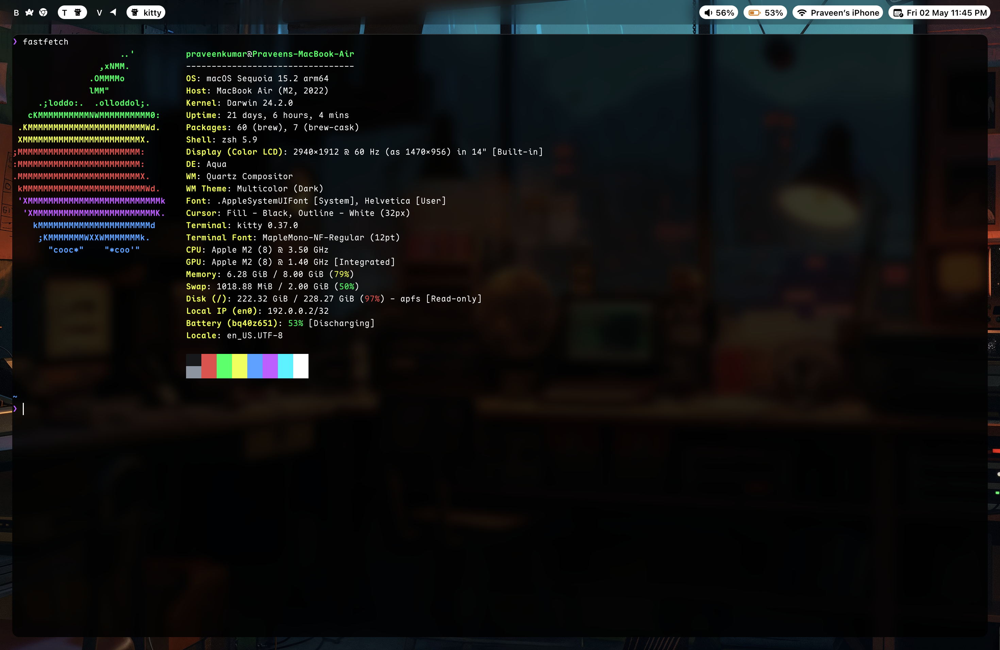
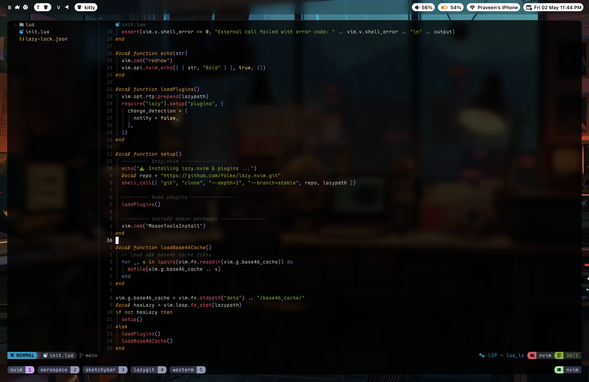

# 🎨 🛠️ 🖥️ Setup Showcase

This page displays detailed screenshots of my dotfiles configuration in action.

## Terminal Setup

### Kitty Terminal

_A fast, feature-rich, GPU-based terminal emulator_

## Development Environment

### Neovim Editor

_Modern Neovim setup with LSP integration and custom themes_

### Tmux Session

_Terminal multiplexer with custom status bar_

## macOS Desktop

### Sketchybar

_Custom macOS status bar replacement_

### Aerospace Window Manager

_Tiling window manager for macOS_

## File Management

### Yazi File Manager

_Terminal file manager with image preview_

### Lazygit Interface

_Terminal UI for git commands_

---
