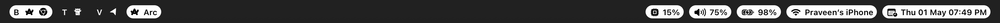

# 🎨 🛠️ 🖥️ Setup Showcase

This page displays detailed screenshots of my dotfiles configuration in action.

## Development Environment

### Neovim Editor

_Modern Neovim setup with LSP integration and custom themes_

### Tmux Session

_Terminal multiplexer with custom status bar_

## macOS Desktop

### Sketchybar

_Custom macOS status bar replacement_

---

