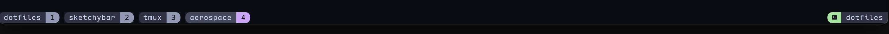

# 🖥️ Tmux Configuration

<div align="center">

<br/>


_A powerful terminal multiplexer with custom configuration_

</div>

## 📸 Preview



## ✨ Features

- Session persistence
- Window and pane management
- Custom key bindings
- Plugin support via TPM
- Beautiful statusline

## 🔌 Plugin Management

This configuration uses [TPM (Tmux Plugin Manager)](https://github.com/tmux-plugins/tpm) for managing plugins.

### Installation

To install TPM, run the following command:

```bash
git clone https://github.com/tmux-plugins/tpm ~/.config/tmux/plugins/tpm
```

### Plugin Commands

- **Install plugins**: `prefix + I`
- **Update plugins**: `prefix + U`
- **Remove unused plugins**: `prefix + alt + u`

## 📚 Usage Tips

- The default prefix key is set to <kbd>ctrl</kbd>+<kbd>' '</kbd>
- Create a new window with <kbd>prefix</kbd>+<kbd>c</kbd>
- Split panes horizontally with <kbd>prefix</kbd>+<kbd>-</kbd>
- Split panes vertically with <kbd>prefix</kbd>+<kbd>|</kbd>
- Navigate between panes using <kbd>ctrl</kbd>+<kbd>h/j/k/l</kbd>
